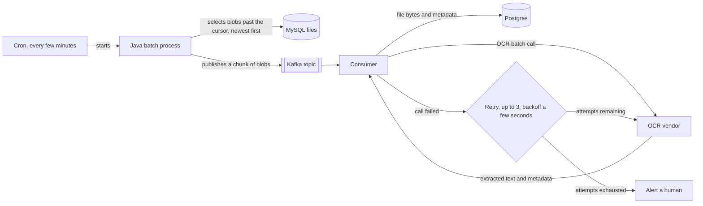
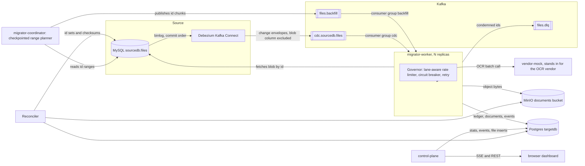

# file-migration-system

Migrate roughly 15 million files stored as blobs in a MySQL database. Every file goes to a third
party OCR vendor for text extraction, and the file plus its extracted metadata lands in a new
system: object storage for the bytes, Postgres for the metadata. While the migration runs, any
file newly added to the source database must be available in the new system within one hour.

The first two sentences describe a batch job. The last one is what makes the problem interesting:
for however many days the migration takes, the same system has to be a bulk migration and a live
pipeline at once.

This README is mostly an argument. Here is the design anyone reaches for first, here is exactly
where it fails, and here is what this implementation does instead. Running instructions are
further down.

**Live demo:** `TODO: paste the hosted dashboard URL here.`

## The straightforward design

One cron job, one queue, one consumer. Newest rows first, so fresh files clear the pipeline
ahead of the old backlog and the one hour requirement takes care of itself.



It works on a whiteboard, and it works against a few thousand test rows. Most of the ways it
fails stay invisible until it runs against the real corpus.

## Where that design breaks

**Detection latency.** The one hour clock starts when a row commits, not when the job next wakes
up. A five minute interval can spend five of those sixty minutes before any work starts, and
everything else has to fit in what is left: queue wait behind everything earlier chunks already
published, the vendor call, retries, the object write, the metadata write. Shortening the
interval raises the cost of a scan against a 15 million row table; lengthening it spends more of
the budget on nothing. No setting of that knob makes the deadline a property of the design.

**Watermark correctness.** `WHERE updated_at > cursor` is correct only if commit order matches
timestamp order, and it does not. A transaction that takes its timestamp, runs for a few seconds,
and commits after the cursor has already moved past that timestamp is never selected again.
Nothing throws, no metric moves, no retry fires, because nothing in the poller's view of the
world knows that row exists. The rows lost this way are exactly the recently written ones the one
hour requirement is about.

**Scope.** The query finds inserts. A file updated during the migration keeps its stale extracted
text in the target; a file deleted from the source stays in the target forever. Across a
migration window measured in weeks, that is not a set of files that are missing, which
reconciliation would notice, but a growing set that are confidently wrong.

**Prioritization.** Sorting newest first inside one queue defends the requirement only as an
emergent property of the sort. There is no isolation: if backfill volume is high enough, the sort
has to actively hold a slice of throughput for live traffic, and any edge case in that logic
starves it silently. One queue also produces one lag number, blended across 15 million old files
and the handful written in the last minute, so there is nothing to alert on. The number that
matters is invisible inside the number you have.

**Message payload.** Kafka's default `message.max.bytes` is 1 MB. Putting blobs on the topic means
a broker reconfiguration the first time file sizes creep past it, and it means every consumer
replaying from an earlier offset re-reads however many gigabytes of file content sat in the log.
Replay stops being a routine recovery tool.

**Failure handling.** Three attempts a few seconds apart is a retry budget sized for one bad
request, not a bad hour. A vendor outage lasting longer than that budget converts the entire
in-flight backlog into permanent failures within seconds, and then sends an alert. Alerting a
human is a notification, not a recovery path: by the time anyone reads it, the work is already
condemned and someone has to reconstruct which files to replay.

**Idempotency.** At-least-once delivery means a worker can call the vendor, get billed for the
extraction, and crash before writing anything. The redelivery has no way to know the call already
happened, so it pays for extraction twice and risks a duplicate row. At 15 million files a small
redelivery rate is a large bill.

**Capacity.** The vendor is the bottleneck, and its rate limit times its batch size sets the
ceiling. Nothing about worker count or partition count moves it.

| Effective throughput | Time to migrate 15,000,000 files |
| --- | --- |
| 10 files/s | ~17 days |
| 100 files/s | ~42 hours |
| 1,000 files/s | ~4.2 hours |

Same architecture, three completely different projects. Without those numbers written down, the
design cannot be checked against reality, only agreed with.

**Completion.** No definition of done, no verification, no cutover. An empty queue is not proof
that 15 million files arrived intact, and nothing here says how reads move to the new store.

## What this system does instead



**Binlog CDC instead of a timestamp cursor.** Debezium reads the MySQL binlog, so every committed
change is captured as an ordered event in commit order. There is no window for a late commit to
land behind a cursor, no poll interval spending the budget, and inserts, updates, and deletes all
arrive: an update revises the target row, a delete tombstones the ledger row and removes the
object. Detection latency drops from a poll interval to the time it takes an event to travel.
The cost is a Kafka Connect worker and a schema history topic that a poller would not need.

**Two independent lanes.** The backfill sweep and the live changes are separate topics with
separate consumer groups, separate rate-limiter shares, and separate lag metrics.
`CDC_RESERVED_RATE_PCT` is reserved off the top for the live lane, backfill gets what is left, and
a shared permit pool caps the two together at the vendor's real budget. Isolation is structural
rather than emergent, and each lane's queue depth is reported on its own, so a starved lane is a
number you can alert on.

**Claim check.** Debezium excludes the blob column and the backfill lane publishes only ids.
Every Kafka message carries ids and nothing else; the worker fetches the blob from MySQL when it
needs it. Message size is independent of file size, and replaying a topic from the start costs a
sequence of small reads.

**A ledger with a claim lease.** `migration_state` in Postgres records each file's status, and
the OCR payload is written and checkpointed before the object or the document row. A redelivery
after a crash finds the cached payload and skips the vendor call, so extraction is paid for once
no matter how many times a message comes back. Claims are leased and renewed on a short interval,
scoped to the ids a call actually owns, so the lease is sized against the renewal interval rather
than against the slowest possible batch, and a dead worker's files are reclaimable in seconds.

**A governor instead of a retry count.** The rate limiter enforces the vendor's budget across both
lanes. The circuit breaker stops calls to a vendor already proven unreachable and pauses every
Kafka consumer container in the process, both lanes, so the backlog accumulates on the broker
instead of being claimed, failed, and endlessly redelivered. It resumes on the move to
`HALF_OPEN`, not only on `CLOSED`, since a paused consumer can never give the breaker a trial call
to learn from. A vendor outage of any length slows the migration down; it never condemns a file.

**A dead letter topic for what is genuinely unprocessable.** A file the vendor rejects as
unreadable, or one whose source row vanished, is marked `FAILED_PERMANENT` in the ledger and
published to `files.dlq` with its lane, error class, attempt count, and last error, so something
downstream can act on it without polling Postgres. The dashboard lists the same files in a Set
aside row.

**Object storage for bytes, Postgres for metadata.** Blobs land in an S3-compatible bucket keyed
by source id, and the document row carries the checksum, the extracted text, the confidence, and
the object key.

**A reconciler that compares id sets.** `POST /api/reconcile` walks the source table, the ledger,
and the document table by id in fixed-size pages, recomputes every checksum and OCR text directly
from the source blob, and reports explicit sets: missing documents, orphan documents, missing
ledger rows, orphan ledger rows, checksum mismatches, OCR mismatches, unreadable objects,
permanent failures. `clean: true` is the definition of done.

Full reasoning per decision, plus known limits, is in [docs/ARCHITECTURE.md](docs/ARCHITECTURE.md).

## Defects that only appeared once it was running

The failures above are the ones you can reason your way to. These are the ones that needed the
thing built and pushed.

**A retry cap counting the wrong events.** The cap on permanent failure counted every claim
attempt rather than consecutive failures. During a vendor outage the circuit breaker flaps between
open and half-open by design, and each flap reclaims and re-fails the files in flight, so any
outage longer than about a minute condemned perfectly healthy files. The test covering it held the
vendor down for two seconds, fewer breaker cycles than the cap needed, so it passed. The ledger
now keeps `attempts` as a lifetime counter that never condemns anything and `consecutive_failures`
as the gate, and the test holds the outage open for 65 seconds while asserting continuously
throughout.

**A reconciler that could bless a broken migration.** Comparing row counts across three tables
reports clean when one missing row and one orphan row cancel out in the totals. It compares id
sets now, in both directions, on top of recomputing content from the source.

**Partitioning that was configured and silently unused.** The topics declared three partitions
each, and the CDC topic was being created with one. Two independent causes: `operation-timeout: 3`
in the Kafka admin config bound as 3 milliseconds rather than 3 seconds, and `fail-fast: false`
swallowed the resulting timeout, so topic creation quietly never happened and the broker
auto-created at its own default the moment anything produced. Separately, the backfill coordinator
published with a null key, which lets the sticky partitioner drop an entire burst onto one
partition. The timeout is `30s` now, records are keyed by their first id, and connector
registration refuses to proceed unless the CDC topic already has the partition count the stack
expects.

**Two tests that could not fail.** One was guarded by an assumption that skipped the whole class
when its infrastructure was unreachable, while still reporting green. One asserted on global row
counts across tables that earlier runs never cleaned up, so it was measuring leftovers. The first
is now a real integration test against a real database, split from the unit suite by naming
convention. The second captures a baseline and asserts on deltas, and its cleanup is deterministic.

## Quickstart

```bash
cp .env.example .env
docker compose up
```

Wait for `docker compose ps` to report healthy, then open **http://localhost:8080**. On a cold
start the seeder loads 500 synthetic files into MySQL, the backfill coordinator plans and drains
them, and the dashboard should show all 500 stored within a few stats ticks.

## What to try in the demo

- **Add files and watch them travel.** The Controls panel inserts 1, 10, 100, or 1,000 rows
  straight into `sourcedb.files`, the same table an application write would hit. Debezium picks
  them up off the binlog and each one steps through the pipeline columns.
- **Take the vendor down.** Switch the vendor mode to *Vendor: offline* and add files. Within a
  few failed calls the breaker pill flips to OPEN and every consumer pauses. Nothing is lost and
  nothing retries into a wall. Switch back to *Vendor: working* and the breaker moves to
  HALF_OPEN, trial calls succeed, consumers resume on their own, and the queue drains.
- **Watch freshness.** The Freshness panel tracks how long the oldest unfinished live-lane file
  has been waiting, against the alert and breach markers from `SLA_ALERT_SECONDS` and
  `SLA_TARGET_SECONDS`.
- **Start over.** *Restart demo* truncates the source table, clears the target stores, and
  reloads the same corpus. It asks for a second click before firing.

## Verifying a migration

```bash
curl -X POST http://localhost:8080/api/reconcile
```

Reports row counts plus the explicit id-set and content checks described above. `clean: true`
means every one of those lists is empty.

## Running the tests

Unit tests for the migrator need no infrastructure:

```bash
cd services/migrator && mvn test
```

Integration tests run against the real stack, so bring it up first and stop the containerized
worker and coordinator, every time. Both keep consuming the live topics otherwise, and a
container claiming a test's own ids fails that test for reasons unrelated to what it checks. Each
integration class that writes to the source database checks for those containers and fails
immediately with the command to run if it finds them.

```bash
docker compose up -d
docker compose stop migrator-worker migrator-coordinator
cd services/migrator && mvn verify
```

Control plane tests:

```bash
cd services/control-plane && yarn test
```

## Configuration

Every knob is a `.env` variable. The ones that change the shape of a run:

| Variable | Default | Controls |
| --- | --- | --- |
| `VENDOR_RATE_LIMIT_RPS` | `50` | The vendor's request budget per second, and the ceiling the rate limiter enforces across both lanes. With `VENDOR_BATCH_SIZE`, this is the throughput ceiling. |
| `VENDOR_BATCH_SIZE` | `25` | Files per OCR call. The backfill lane chunks to this; the live lane sends one id per envelope. |
| `CDC_RESERVED_RATE_PCT` | `20` | Share of the rate budget reserved for the live lane, so a saturated backfill cannot starve it. |
| `WORKER_CONCURRENCY` | `8` | Kafka listener concurrency per lane inside each worker. |
| `MAX_RETRY_ATTEMPTS` | `5` | The per-call retry cap, and the consecutive-failure cap past which a file is condemned. Never gated on lifetime attempts. |
| `BREAKER_FAILURE_RATE_THRESHOLD` | `50` | Failure rate percentage that trips the breaker open. |
| `BREAKER_OPEN_DURATION_SECONDS` | `10` | How long the breaker stays open before letting trial calls through. |
| `CLAIM_LEASE_SECONDS` | `60` | How long a claimed file stays owned before another attempt may reclaim it. Renewed every `CLAIM_RENEW_INTERVAL_SECONDS`. |
| `SLA_TARGET_SECONDS` | `3600` | The one hour requirement, as a number the dashboard checks against. |
| `SEED_FILE_COUNT` | `500` | How many synthetic files a cold start loads. |

<details>
<summary>Everything else</summary>

The full set, with defaults, is in [.env.example](.env.example): seeder sizing and batching,
vendor latency and failure mode, backfill range size and lease, plan and nack intervals, topic
partition counts, DLQ and reconcile batch sizes, JDBC pool size, event polling and SSE limits,
and service URLs. All of it is plumbed through `docker-compose.yml`.

`MICROBATCH_MAX_WAIT_MS` is declared and wired to nothing; no consumer here batches by a
wait-time window.

</details>

### Scaling workers

```bash
docker compose up --scale migrator-worker=4
```

Four workers consume the same two consumer groups, so partitions rebalance and each instance
claims a different slice. Total throughput does not change: `VENDOR_RATE_LIMIT_RPS` is shared
across all of them, because adding workers does not make the vendor accept more calls. Only
`migrator-worker` is meant to be scaled. It publishes its HTTP port to an ephemeral host port so
replicas do not collide; `docker compose port migrator-worker 8082` finds a specific one.

## Documentation

- [docs/ARCHITECTURE.md](docs/ARCHITECTURE.md): component and request-flow diagrams, the reasoning
  behind each decision, and known limits.
- [docs/DEPLOYMENT.md](docs/DEPLOYMENT.md): single-instance AWS deployment, CDK stack, and CI.
