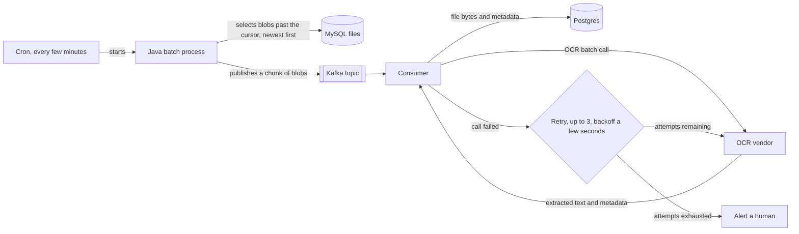
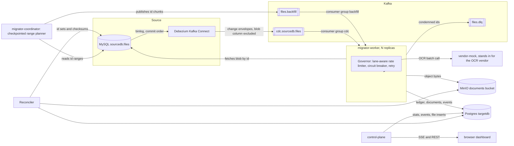

# File Migration System - Demo

Migrate roughly 15 million files stored as blobs in a MySQL database. Every file goes to a third
party OCR vendor for text extraction, and the file plus its extracted metadata lands in a new
system: object storage for the bytes, Postgres for the metadata. While the migration runs, any
file newly added to the source database must be available in the new system within one hour.

**Live demo:** [filemigrationdemo.josecanhelp.com](https://filemigrationdemo.josecanhelp.com)

## The initial design

One cron job, one queue, one consumer. Newest rows first, so fresh files clear the pipeline ahead
of the old backlog and the one hour requirement takes care of itself.

It passes a run of a few thousand test rows. At 15 million most of its failure modes are silent.

## Where that design breaks

**Detection latency.** The clock starts when a row commits, not when the job next wakes up. A five minute interval spends five of the sixty minutes before any work starts, and the rest has to cover queue wait behind earlier chunks, the vendor call, retries, the object write, and the metadata write. Shortening the interval raises the cost of scanning a 15 million row table. Lengthening it spends more of the budget on nothing.

**Watermark correctness.** `WHERE updated_at > cursor` is correct only if commit order matches timestamp order, and it does not. A transaction that takes its timestamp, runs for a few seconds, and commits after the cursor has moved past that timestamp is never selected again.

**Scope.** The query finds inserts. A file updated during the migration keeps its stale extracted text in the target, and a file deleted from the source stays there forever. Across a window measured in weeks that is not a set of files that are missing, but a growing set that are wrong.

**Failure handling.** Three attempts a few seconds apart is a budget sized for one bad request, not a bad hour. A longer outage would produce a large number of messages. Someone still has to reconstruct which files to replay.

**Idempotency.** At-least-once delivery lets a worker call the vendor, get billed for the extraction, and crash before writing anything. The redelivery has no way to know that happened, so it pays again and risks a duplicate row. At 15 million files a small redelivery rate is a large bill.

## What this system does instead

**Binlog CDC instead of a timestamp cursor.** Debezium reads the MySQL binlog, so every committed
change arrives as an ordered event in commit order. Inserts, updates and deletes all arrive: an update
revises the target row, a delete tombstones the ledger row and removes the object. The cost is a Kafka Connect worker and a schema history topic that a poller would not need.

**Two independent lanes.** Backfill and live changes are separate topics with separate consumer groups, separate rate-limiter shares, and separate lag metrics.

**A ledger with a claim lease.** `migration_state` in Postgres records each file's status, and the OCR payload is written and checkpointed before the object or the document row. A redelivery after a crash finds the cached payload and skips the vendor call, so extraction is paid for once however many times a message comes back.

**A governor instead of a retry count.** The rate limiter enforces the vendor's budget across both lanes. The circuit breaker stops calls to a vendor already proven unreachable and pauses every Kafka consumer container in the process, both lanes, so the backlog accumulates on the broker instead of being claimed, failed, and endlessly redelivered. A vendor outage of any length slows the migration down; it never condemns a file.

**A dead letter topic.** A file the vendor rejects as unreadable, or one whose source row vanished, is marked `FAILED_PERMANENT` and published to `files.dlq` with its lane, error class, attempt count, and last error, so something downstream can act on it without polling Postgres.

Bytes go to an S3-compatible bucket keyed by source id. The document row carries the checksum, the extracted text, the confidence, and the object key.

## What to try in the demo

- **Add files and watch them travel.** The Controls panel inserts 1, 10, 100, or 1,000 rows
  straight into `sourcedb.files`, the same table an application write would hit. Debezium picks
  them up off the binlog and each one steps through the pipeline columns.
- **Take the vendor down.** Switch the vendor mode to *Vendor: offline* and add files. Within a few
  failed calls the breaker pill flips to OPEN and every consumer pauses. Switch back to *Vendor:
  working* and the breaker moves to HALF_OPEN, trial calls succeed, consumers resume on their own,
  and the queue drains.
- **Watch freshness.** The Freshness panel tracks how long the oldest unfinished live-lane file has
  been waiting, against the markers from `SLA_ALERT_SECONDS` and `SLA_TARGET_SECONDS`.
- **Start over.** *Restart demo* truncates the source table, clears the target stores, and reloads
  the same corpus. It asks for a second click first.

Component diagrams, the Postgres schema, and the known limits are in
[docs/ARCHITECTURE.md](docs/ARCHITECTURE.md).