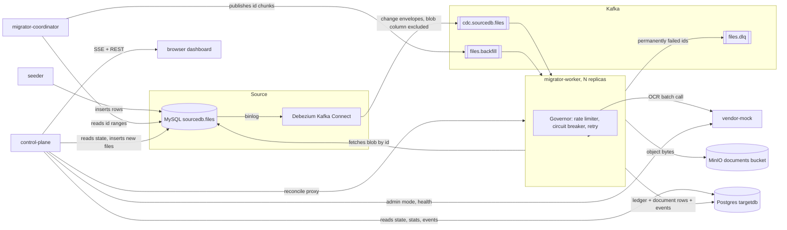
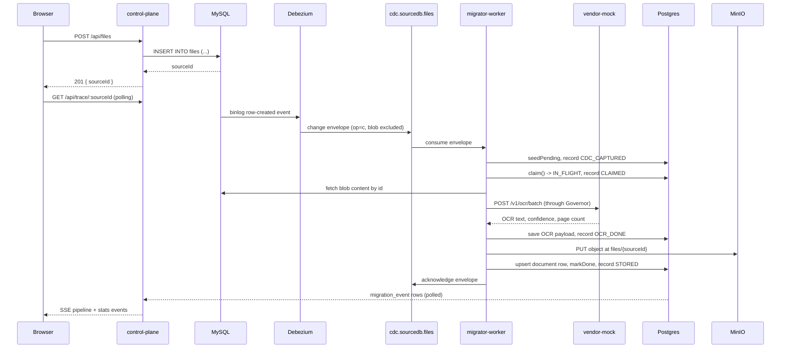

# Architecture

## Component overview

## Request flow: a file added from the dashboard

## Postgres tables

| Table | Holds |
| --- | --- |
| `document` | The migrated record, one row per source id: filename, content type, object key, byte size, `checksum_sha256`, OCR text, confidence, page count, vendor job id, `migrated_at`. |
| `migration_state` | The ledger: lane, status, `attempts`, `consecutive_failures`, `source_version`, `source_created_at`, checksum, cached `ocr_payload`, last error. |
| `migration_event` | Append-only stage trace: source id, stage, lane, JSON detail, timestamp. |
| `backfill_checkpoint` | One row per planned id range, keyed by `(range_start, range_end)`, with a status and `claimed_at`. Claims use `FOR UPDATE SKIP LOCKED`. |

`migration_state.status` is one of `PENDING`, `IN_FLIGHT`, `OCR_DONE`, `DONE`, `FAILED_RETRYABLE`,
`FAILED_PERMANENT`. The happy path runs `PENDING` to `IN_FLIGHT` to `OCR_DONE` to `DONE`.

## Mechanisms

### Claim check

Kafka's default message size cap is 1 MB. The Debezium connector excludes the blob column
(`column.exclude.list`), and the backfill lane publishes only ids. Every message in this system
carries a source id, or a chunk of ids, and nothing else; the worker fetches the blob from MySQL
when it needs it. Messages stay small regardless of file size, and replaying a topic from the start
costs a sequence of small reads instead of every blob that ever moved through it.

### Claim lease renewal

A claim that marks a row `IN_FLIGHT` and then goes quiet forces the lease to be sized for the
slowest batch in the system, because nothing distinguishes a worker still working from one that
died the instant it claimed. Each call renews its lease on a short interval, scoped to the ids that
call actually claimed. `CLAIM_LEASE_SECONDS` only has to be a small multiple of
`CLAIM_RENEW_INTERVAL_SECONDS`, so a real crash is detected in about a renewal interval rather than
a batch.

### Two failure counters

`attempts` is a lifetime count. It increments on every claim and never condemns anything.
`consecutive_failures` increments only for a failure retrying cannot fix on its own (the source row
disappeared, the vendor's response omitted the id) and resets to zero on every success. Vendor
`TRANSIENT` and `RATE_LIMITED` failures never touch it. Without the split, a vendor outage would
condemn healthy files: the breaker flaps between open and half-open while testing recovery,
reclaiming and re-failing files each time, and a cap gated on one shared counter would send them to
`FAILED_PERMANENT` for no reason but the outage's length.

### sla_lag_seconds

Vendor error rate answers whether the vendor is healthy, which is a different question from whether
the migration is meeting its SLA. A vendor that stays slow without ever technically erroring, well
inside `VENDOR_LATENCY_MS` request by request, can back a queue up past any target with no
vendor-side signal tripping. `sla_lag_seconds` is `now()` minus the oldest `source_created_at`
across `migration_state` rows on the cdc lane whose status is not `DONE`. `SLA_ALERT_SECONDS` and
`SLA_TARGET_SECONDS` are checked against that number.

### Reconciling by id sets

Row counts across the source table, the ledger, and the document table can agree perfectly while one
document row is orphaned and one source row has no document at all. The reconciler walks all three
by id, in fixed-size pages, and reports explicit sets: source ids with no document, document ids
with no source row, source ids with no ledger row, ledger ids with no source row. It also recomputes
every checksum and OCR text from the source blob rather than trusting the columns the pipeline
wrote. `clean: true` means every one of those sets is empty.

## Known limits

- **Single Kafka broker, no replication.** Every topic is created with `replicas: 1`
  (`KafkaTopicConfig`), and the compose file runs one Kafka container in KRaft mode. A broker
  failure loses whatever has not been consumed. A real deployment needs a multi-broker cluster with
  a replication factor above one.
- **`migration_event` writes one row per stage per file.** At 15 million files times roughly six
  stages, that is close to 100 million append-only rows for one run, growing without bound across
  runs since nothing prunes it. At that scale it needs sampling, a retention policy, or a different
  store. None of that exists today.
- **No authentication anywhere.** The control plane's API, the migrator's `/internal/reconcile`,
  and the vendor mock's `/admin/mode` are open with no credential check. MinIO and Postgres run on
  their documented default credentials. Fine for a local demo, not for anything reachable outside a
  trusted network.
- **Reader cutover is described, not implemented.** This system writes files into the new store. It
  includes nothing that points an application's reads at the new store instead of the old one,
  staged or otherwise.
- **MinIO runs single-node.** One container, one data volume, no erasure coding or distributed
  mode. A drop-in S3-compatible target for local development, not a durability story.
- **The coordinator is single-instance.** `migrator-coordinator` is never scaled the way
  `migrator-worker` is, and nothing does leader election for a second one. `backfill_checkpoint`
  claims use `FOR UPDATE SKIP LOCKED`, so a second instance would plan and claim ranges the first
  had not touched, but one coordinator covers the planning workload here.
- **The dashboard's Captured column is a session-local tally.** It counts CDC capture events seen
  since the browser tab opened, not a status tracked anywhere durable, since capture is a transient
  point between the source table and a claim. Reloading resets it to zero; the interface says so
  next to the column.
- **`MICROBATCH_MAX_WAIT_MS` is unused.** Declared in `.env.example` and plumbed nowhere. No
  consumer batches records by a wait-time window.
