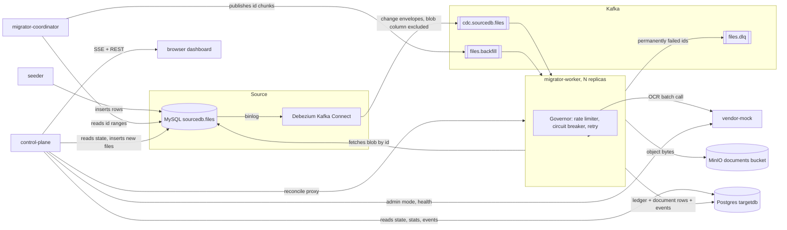
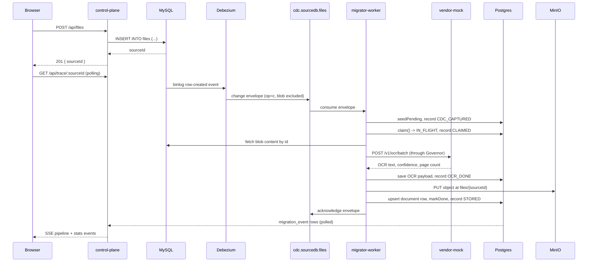

# Architecture

## Component overview

## Request flow: a file added from the dashboard

## Design decisions

### Binlog CDC over timestamp polling

A poller that selects rows with `updated_at > last_seen_timestamp` looks correct until a
transaction commits with a timestamp slightly behind where the cursor has already moved: the
poller's next query starts from a point in time strictly after that row's timestamp, and the row
is never selected again. No error is thrown, no metric moves, and no retry ever fires, because
nothing in a poller's own view of the world knows that row exists. The failure is not slow
throughput or occasional duplication that reconciliation would catch downstream; it's silent,
permanent loss of exactly the kind of row a wall-clock race condition would produce, on both
MySQL's own commit ordering and on any polling interval short enough to be practical. Reading the
binlog through Debezium instead means every committed row change is captured as an ordered event
in transaction commit order, with no window where a commit can land behind a cursor that has
already moved past it. The tradeoff is operational complexity, a Kafka Connect worker and a
schema history topic that a poller wouldn't need, in exchange for a guarantee a poller cannot
give at any polling interval.

### Two independent lanes over one sorted queue

A single work queue for both the backfill sweep and live CDC changes, sorted by priority or
timestamp, makes isolation an emergent property of how well that sort holds up under load: if
backfill volume is high enough, sorting logic has to actively defend CDC's slice of throughput,
and any bug or edge case in that logic starves CDC silently, with no independent metric pointing
at which lane is actually being served. Running backfill and CDC as two Kafka topics with their
own consumer groups, their own rate-limiter share (`CDC_RESERVED_RATE_PCT` reserved off the top,
backfill gets what's left, a shared permit pool caps the combined total), and their own lag
metric makes the isolation structural: CDC's reserved share exists whether or not backfill is
running at all, and `byLane` in the stats snapshot reports each lane's queue depth independently,
so a starved lane shows up as a number instead of a hunch.

### Claim check

Kafka's default message size cap is 1 MB, and pushing whole file blobs through Kafka would mean
every message close to or over that cap needs a broker reconfiguration the moment file sizes
creep up, plus every consumer replaying the topic from an earlier offset re-reads however many
gigabytes of blob content sat in the log for however far back it replays. Debezium's connector
config excludes the blob column entirely (`column.exclude.list`), and the backfill lane only ever
publishes ids, never content. Every Kafka message in this system carries a source id (or a chunk
of ids) and nothing else; the worker fetches the actual blob from MySQL by id when it needs it.
Kafka messages stay small regardless of file size, and replaying the topic from the start costs a
sequence of small reads instead of the full weight of every blob that ever moved through it.

### Ledger-first idempotency with a claim lease

At-least-once delivery means a worker can call the vendor, get billed for OCR, and crash before
committing that result anywhere; the next redelivery has no way to know the call already
happened unless something durable recorded it first. `migration_state.ocr_payload` is written
and the row moved to `OCR_DONE` before the object is written to MinIO or the document row is
written to Postgres, so a retry after a crash checks for a cached payload first and skips the
vendor call entirely if one exists, paying for OCR exactly once no matter how many times the
claim is redelivered. That guarantee needs a claim mechanism with its own liveness signal: a
claim that just marks a row `IN_FLIGHT` with no further updates forces the lease to be sized for
the worst case, however long the slowest batch in the system could plausibly take, because
nothing distinguishes a worker still legitimately working from one that died the instant it
claimed. Renewing the lease on a short interval, scoped strictly to the ids a given call actually
claimed, decouples those two numbers: `CLAIM_LEASE_SECONDS` only has to be a small multiple of
`CLAIM_RENEW_INTERVAL_SECONDS`, not a bound on total batch processing time, so detecting a real
crash takes on the order of the renewal interval instead of the order of a batch.

### Separating consecutive failures from lifetime claim attempts

A single retry counter that increments on every claim, successful or not, cannot tell a file that
keeps legitimately succeeding after updates from one that has never once succeeded: both climb the
same number over a long enough lifetime. Worse, during a vendor outage the circuit breaker itself
causes files to be reclaimed and fail repeatedly as it flaps between open and half-open while
testing recovery, and a retry cap gated on that same counter would condemn perfectly healthy
files to `FAILED_PERMANENT` for no reason but the outage's duration. `migration_state` keeps two
separate counters: `attempts`, a lifetime count that increments on every claim and is never used
to condemn anything, and `consecutive_failures`, which increments only for a failure retrying can
never fix on its own (the source row disappeared, the vendor's response omitted this id) and
resets to zero on every success. A vendor `TRANSIENT` or `RATE_LIMITED` failure never touches
`consecutive_failures` at all, so a vendor outage of any length, however many times it causes a
file to be reclaimed and re-fail, can never trip the cap that sends a file to `FAILED_PERMANENT`.

### A breaker that pauses consumption rather than failing

A bounded retry count sized for a single bad request (five attempts, exponential backoff) is the
wrong shape entirely for a vendor that is down for twenty minutes: exhausting five attempts in a
few seconds and moving on just converts a temporary outage into a wave of permanent-looking
failures, and letting every claimed file exhaust its retries against a vendor that has already
been proven unreachable spends the retry budget for nothing. The circuit breaker here does two
things once it opens: it stops the current call from proceeding at all (no wasted attempts against
a known-down vendor), and a listener pauses every Kafka consumer container in the process, both
lanes, so records stop being fetched and the backlog grows on the broker instead of being claimed,
failed, and endlessly nacked. Resuming on the breaker's move to `HALF_OPEN`, not only on `CLOSED`,
matters too: the breaker can only learn the vendor has recovered by actually letting a few trial
calls through, and a still-paused consumer can never offer it one to test.

### Reconciling by id sets rather than by counts

Comparing row counts across the source table, the ledger, and the document table catches nothing
when a deleted source row and a separate un-migrated row happen to cancel each other out in the
totals: all three counts can agree perfectly while one document row is orphaned (its source row is
gone) and one source row has no document at all. The reconciler instead walks all three tables by
id, in fixed-size pages, and reports explicit sets: which source ids have no matching document,
which document ids have no matching source row, which source ids have no ledger row, which ledger
ids have no source row, on top of recomputing every checksum and OCR text directly from the
source blob rather than trusting columns the pipeline itself wrote. `clean: true` means every one
of those sets is empty, a claim the count comparison alone cannot make.

### sla_lag_seconds as the alert

An alert on vendor error rate answers "is the OCR vendor unhealthy right now," which is not the
same question as "is the migration meeting its SLA." A vendor that recovers quickly after a short
blip never fires an error-rate alert worth waking anyone up for, and a vendor that stays slow but
never technically errors, is well within `VENDOR_LATENCY_MS`'s bounds request by request, can
still let a queue back up past any reasonable target with no vendor-side signal ever tripping.
`sla_lag_seconds` measures the actual thing the SLA is about directly: how long the
oldest unresolved CDC-lane file has been waiting, from the moment its source row was created.
`SLA_ALERT_SECONDS` and `SLA_TARGET_SECONDS` are checked against that number, not against vendor
health, because a vendor dependency being healthy or unhealthy is an implementation detail; the
lag a file has actually been sitting at is the SLA.

## Known limits

- **Single Kafka broker, no replication.** Every topic here is created with `replicas: 1`
  (`KafkaTopicConfig`), and the compose file runs exactly one Kafka container in KRaft mode. A
  broker failure loses whatever hasn't been consumed. A real deployment needs a multi-broker
  cluster with a replication factor greater than one.
- **`migration_event` writes one row per stage per file.** At 500 or 15,000 files this is a
  convenient full trace of every file's path. At 15 million files times roughly six stages each,
  it is close to 100 million append-only rows for one run, growing without bound across repeated
  runs since nothing here prunes it. At that scale it needs sampling, a retention policy, or
  moving off Postgres entirely; none of that exists today.
- **No authentication anywhere.** Every HTTP endpoint, the control plane's API, the migrator's
  `/internal/reconcile`, the vendor mock's `/admin/mode`, is open with no credential check. Fine
  for a local demo, not fine for anything reachable outside a trusted network.
  MinIO and Postgres also run on their documented default credentials.
- **Reader cutover is described, not implemented.** This system writes files into the new store;
  it does not include anything that points an application's reads at the new store instead of the
  old one, staged or otherwise. That cutover is a separate piece of work this repository doesn't
  touch.
- **MinIO runs single-node.** One container, one data volume, no erasure coding or distributed
  mode. It is a drop-in S3-compatible target for local development, not a durability story.
- **The coordinator is single-instance.** `migrator-coordinator` is never scaled the way
  `migrator-worker` is, and nothing here does leader election for a second one. This is
  deliberate rather than an oversight: `backfill_checkpoint` claims use `FOR UPDATE SKIP LOCKED`,
  so a second coordinator instance would already behave correctly if it existed, planning and
  claiming ranges the first one hasn't touched, but a single coordinator is enough for the
  planning workload here and a second one would add nothing but idle capacity.
- **The dashboard's Captured column is a session-local tally.** It counts CDC capture events
  observed since the browser tab opened, not a status this system tracks anywhere durable, since
  capture is a transient point between the source table and a claim rather than a state a row
  sits in. Reloading the dashboard resets it to zero; the interface says as much next to the
  column.
- **`MICROBATCH_MAX_WAIT_MS` is unused.** It's declared in `.env.example` and plumbed nowhere:
  no consumer in this codebase batches records by a wait-time window. Left in as a placeholder for
  that kind of tuning, not as a lever that currently does anything.
