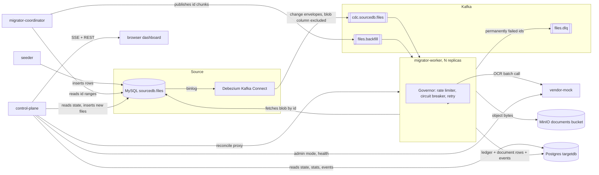
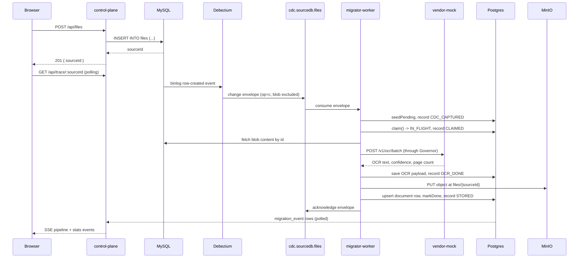

# Architecture

## Component overview

## Request flow: a file added from the dashboard

## Postgres tables

| Table | Holds |
| --- | --- |
| `document` | The migrated record, one row per source id: filename, content type, object key, byte size, `checksum_sha256`, OCR text, confidence, page count, vendor job id, `migrated_at`. |
| `migration_state` | The ledger: lane, status, `attempts`, `consecutive_failures`, `source_version`, `source_created_at`, checksum, cached `ocr_payload`, last error. |
| `migration_event` | Append-only stage trace: source id, stage, lane, JSON detail, timestamp. |
| `backfill_checkpoint` | One row per planned id range, keyed by `(range_start, range_end)`, with a status and `claimed_at`. Claims use `FOR UPDATE SKIP LOCKED`. |

`migration_state.status` is one of `PENDING`, `IN_FLIGHT`, `OCR_DONE`, `DONE`, `FAILED_RETRYABLE`,
`FAILED_PERMANENT`. The happy path runs `PENDING` to `IN_FLIGHT` to `OCR_DONE` to `DONE`.

## Known limits

- **Single Kafka broker, no replication.** Every topic is created with `replicas: 1` (`KafkaTopicConfig`), and the compose file runs one Kafka container in KRaft mode. A broker failure loses whatever has not been consumed. A real deployment needs a multi-broker cluster with a replication factor above one.